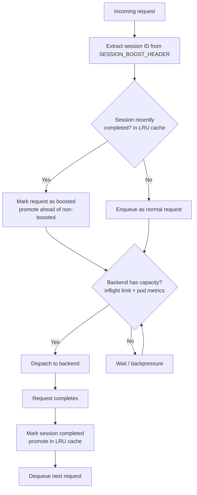

# Session Boost Queue

Kthena Router session boost is a per-model request scheduling strategy that optimizes multi-turn conversation performance by prioritizing follow-up requests from the same conversation session. This maximizes **prefix cache hit rate** on LLM inference backends (e.g., vLLM), significantly reducing Time-to-First-Token (TTFT) for multi-turn conversations.

This guide explains what session boost does, when to use it, how to enable it, and how to verify it is working. Session boost and [Fairness Scheduling](./fairness-scheduling) are **mutually exclusive** strategies: enable one or the other, not both.

## Overview

The router schedules requests through a per-model queue. When session boost is enabled, request priority is computed from recent session completions instead of per-user fairness. The two strategies share the same admission control and backpressure machinery but cannot be enabled together.

Modern LLM inference engines like vLLM maintain a **prefix cache** (KV cache) that stores previously computed key-value attention states. In multi-turn conversations, each follow-up message shares a large prefix with the previous turn. If the follow-up request is processed shortly after the prior turn completes, the prefix cache is still warm, and the engine can skip recomputing attention for the shared prefix—substantially reducing TTFT.

Without session boost, a follow-up request may be queued behind unrelated requests. By the time it reaches the backend, the prefix cache may have been evicted, forcing a full recomputation.

When session boost is enabled, the router does the following:

1. Extracts the session identifier from the HTTP header configured via `SESSION_BOOST_HEADER` environment variable.
2. Checks whether the same session is currently tracked as recently completed. The router keeps the most-recently-completed sessions in a bounded **LRU cache** (sized by `SESSION_BOOST_MAX_SESSIONS`); the least-recently-used session is evicted automatically when the cache is full.
3. If yes, marks the new request as **boosted** and promotes it ahead of non-boosted requests in the queue.

The following diagram summarizes this flow:



> An optional **grace period** can briefly hold the dequeue slot after a request completes to wait for a same-session follow-up. It is **disabled by default** and is an advanced, scenario-specific tuning knob—see [Advanced: Grace Period](#advanced-grace-period-use-with-caution) at the end of this guide.

## When to Use Session Boost

Session boost is designed for these scenarios:

- **Multi-turn chat applications**: ChatGPT-like interfaces where users have back-and-forth conversations with an LLM. Each turn builds on the previous conversation context.
- **Agentic workflows and RAG chains**: Automated pipelines that issue multiple sequential requests in the same session, where each request depends on the previous response.
- **Low-latency prefix cache optimization**: Workloads where minimizing TTFT is critical and the same session's requests benefit from being processed back-to-back on warm KV cache.
- **Prefix cache optimization instead of per-user fairness**: When you want the queue to prioritize warm KV cache reuse rather than equitable per-user resource sharing.

Session boost is **not** needed when:

- Your workload is single-turn (independent requests with no shared prefix).
- You need multi-tenant fairness as the primary scheduling concern (use [fairness scheduling](./fairness-scheduling) instead). Session sticky routing is complementary and can be combined with session boost (see [Operational Notes](#operational-notes)).

## Prerequisites

- A Kubernetes cluster with Kthena installed.
- A deployed `ModelRoute` and backend `ModelServer` (e.g., vLLM) that supports prefix caching.
- Clients that include a consistent session identifier header across related requests in a conversation.
- Fairness scheduling **not** enabled. Session boost and `ENABLE_FAIRNESS_SCHEDULING` are mutually exclusive; enabling both is a configuration error.

## Enable Session Boost

### Helm Values

The simplest way to enable session boost is through Helm values. Session boost is an independent scheduling strategy, mutually exclusive with fairness, so its settings live under `sessionBoost`:

```yaml
networking:
  kthenaRouter:
    sessionBoost:
      enabled: true
      header: "X-Session-ID"
      maxSessions: 4096          # LRU cache of recently-completed sessions kept warm
      inflightPerPod: 16         # total inflight = inflightPerPod x backend pod count
```

Apply with Helm:

```bash
helm upgrade --install kthena charts/kthena \
  --namespace kthena-system \
  --create-namespace \
  -f your-values.yaml
```

### Environment Variables

You can also configure session boost directly via environment variables on the `kthena-router` Deployment:

```yaml
env:
- name: ENABLE_SESSION_BOOST
  value: "true"
- name: SESSION_BOOST_HEADER
  value: "X-Session-ID"
- name: SESSION_BOOST_MAX_SESSIONS
  value: "4096"
- name: SESSION_BOOST_INFLIGHT_PER_POD
  value: "16"                 # total inflight = perPod x backend pod count
```

## Configuration Reference

| Environment Variable             | Purpose                                                                          | Default        | Notes                                                                                                                                                                                      |
| -------------------------------- | -------------------------------------------------------------------------------- | -------------- | ------------------------------------------------------------------------------------------------------------------------------------------------------------------------------------------ |
| `ENABLE_SESSION_BOOST`           | Enable the session-boost scheduling strategy                                     | `false`        | Mutually exclusive with `ENABLE_FAIRNESS_SCHEDULING`                                                                                                                                       |
| `SESSION_BOOST_HEADER`           | HTTP header used to identify conversation sessions                               | `X-Session-ID` | Must match what your clients send                                                                                                                                                          |
| `SESSION_BOOST_MAX_SESSIONS`     | Max number of recently-completed sessions kept "warm" for boosting (LRU-bounded) | `4096`         | When the cache is full, the least-recently-used session is evicted automatically. Size it by the number of concurrent conversations you want to keep boosted—no time-based tuning required |
| `SESSION_BOOST_INFLIGHT_PER_POD` | Inflight requests admitted per backend pod                                       | `16`           | The total inflight limit is this value multiplied by the number of backend pods. Size it from the per-pod concurrency (e.g., vLLM's `--max-num-seqs`)                                      |

> `SESSION_BOOST_GRACE_PERIOD` is intentionally omitted from the table above. It is an advanced, scenario-specific knob that is disabled by default; see [Advanced: Grace Period](#advanced-grace-period-use-with-caution).

## Client Integration

Clients must include the configured session header in their requests. All requests belonging to the same conversation should use the same header value:

```bash
# Turn 1
curl -X POST http://kthena-router/v1/chat/completions \
  -H "Content-Type: application/json" \
  -H "X-Session-ID: conv-abc-123" \
  -d '{"model": "llama-3", "messages": [{"role": "user", "content": "Hello"}]}'

# Turn 2 (same session)
curl -X POST http://kthena-router/v1/chat/completions \
  -H "Content-Type: application/json" \
  -H "X-Session-ID: conv-abc-123" \
  -d '{"model": "llama-3", "messages": [{"role": "user", "content": "Hello"}, {"role": "assistant", "content": "Hi!"}, {"role": "user", "content": "Tell me about Kubernetes"}]}'
```

### Custom Header

If your clients already use a different header for session tracking, configure the router to match:

```yaml
env:
- name: SESSION_BOOST_HEADER
  value: "X-Session-ID"
```

Then clients send:

```bash
curl -X POST http://kthena-router/v1/chat/completions \
  -H "X-Session-ID: my-conversation-42" \
  -d '{"model": "llama-3", "messages": [...]}'
```

## How It Works

### Session Tracking (LRU)

The router remembers which sessions recently completed using a bounded **LRU (least-recently-used) cache** rather than a time-based expiry. Each time a request from a session completes, that session is promoted to the most-recently-used position. When the cache exceeds `SESSION_BOOST_MAX_SESSIONS` entries, the least-recently-used session is evicted.

This design is intentional: inference engines such as vLLM evict their prefix (KV) cache the same way—least-recently-used blocks are dropped first under memory pressure. Bounding the boost cache by **session count** therefore mirrors the backend's own warmth model, and it removes the need to guess a time-to-live (TTL). You only size the cache by *how many concurrent conversations* you want to keep boosted:

- Under **high load**, stale sessions are evicted quickly as newer ones complete, so only genuinely warm sessions stay boosted.
- Under **low load**, a few extra entries linger harmlessly—boosting only changes ordering when the queue is actually contended.

### Priority Ordering

The session boost queue uses a simple two-level priority:

1. **Boosted requests** (session tracked in the LRU cache) are always dequeued before non-boosted requests.
2. **Within the same boost level**, requests are served in FIFO order (earliest arrival first).

### Backpressure Control

The queue uses two-level admission control to avoid flooding backends:

1. **Inflight limit**: at most `SESSION_BOOST_INFLIGHT_PER_POD` requests can be in-flight per backend pod; the total limit is that value times the number of backend pods serving the model.
2. **Backend metrics check**: the queue checks backend pod metrics to confirm at least one pod has available capacity before dispatching. These metrics are refreshed by the router's periodic metrics scrape (`METRICS_SCRAPE_INTERVAL`, default `1s`). The backpressure loop is fully event-driven: it re-checks capacity on request completion and on new arrivals. In single-router operation a backend frees capacity only when one of this router's own requests completes, which is exactly a request-completion event — so releases and arrivals alone cover every dequeue opportunity, and no independent polling timer is needed.

When a request completes, the queue immediately attempts to dequeue the next request (release-driven dequeue) rather than waiting for the next metrics refresh.

## Session Boost vs User Fairness

Session boost and user fairness are two mutually exclusive scheduling strategies for the per-model request queue; they configure that queue for different goals:

| Aspect           | Session Boost                      | User Fairness                     |
| ---------------- | ---------------------------------- | --------------------------------- |
| Goal             | Maximize prefix cache hits         | Equitable resource allocation     |
| Activation       | `ENABLE_SESSION_BOOST=true`        | `ENABLE_FAIRNESS_SCHEDULING=true` |
| Requires user ID | No                                 | Yes                               |
| Priority logic   | Boosted > non-boosted, FIFO within | Lower recent usage wins           |
| Best for         | Multi-turn latency optimization    | Multi-tenant contention           |

The two strategies are **mutually exclusive**; enabling both is a configuration error. Enable one or the other based on your primary scheduling concern.

## Choosing Good Settings

Start with the defaults unless you have a specific performance issue.

Recommended tuning:

- **Many concurrent conversations**: increase `SESSION_BOOST_MAX_SESSIONS` so that active sessions are not evicted from the LRU cache before their follow-up arrives. The default (`4096`) suits most deployments; raise it if you serve a larger number of simultaneous conversations.
- **High-throughput backends**: the default per-pod inflight limit (`SESSION_BOOST_INFLIGHT_PER_POD=16`) is conservative. Size it from the per-pod concurrency (e.g., vLLM's `--max-num-seqs`); the total limit scales with the number of backend pods. Reduce for conservative admission control; increase for backends that handle high parallelism.
- **Faster reaction to capacity changes**: the queue re-checks capacity whenever one of its own requests completes or a new request arrives. The capacity check reads the pod metrics scraped every `METRICS_SCRAPE_INTERVAL` (default `1s`); lower it if you want the check to read fresher pod metrics, keeping in mind it also increases metrics scraping load.

## Verify Session Boost

### 1. Check Router Environment

```bash
kubectl -n kthena-system get deployment kthena-router -o yaml | grep SESSION_BOOST
```

Confirm the router is running with expected session boost variables.

### 2. Inspect Logs

When a session boost is triggered, the router logs the event. Look for session boost enqueue and dequeue messages:

```bash
kubectl -n kthena-system logs deploy/kthena-router | grep -i "session boost"
```

### 3. Compare TTFT Under Concurrent Multi-Turn Load

A single multi-turn conversation usually will **not** reveal the benefit of session boost: on its own it does not exercise queue contention, so ordering rarely changes the outcome. (Note that without session sticky routing or pod affinity even a single conversation's turns are **not** guaranteed to reach the same backend pod, so a warm prefix cache is not automatic—see [Operational Notes](#operational-notes).) Session boost only matters when **many multi-turn conversations run concurrently** and contend for backend capacity—then queue ordering decides whether a follow-up is processed while its prefix cache is still warm or after it has been evicted by unrelated traffic. For a meaningful TTFT comparison, you must keep related turns on the same pod (via session sticky routing) **and** generate enough concurrent load to contend the queue.

To observe the effect, generate concurrent load with multiple simultaneous multi-turn sessions (enough to keep the queue contended), then compare aggregate follow-up TTFT:

- **Without session boost**: follow-up requests wait behind unrelated requests; by the time they reach the backend their prefix cache may have been evicted, so follow-up TTFT is high and variable.
- **With session boost**: follow-up requests are promoted ahead of non-boosted requests and reach the backend while the prefix cache is still warm, lowering follow-up TTFT (especially p90/p99) under the same load.

## Operational Notes

- Session state is **in memory** on each router instance. In multi-replica deployments, state is not shared across replicas. Combine with session sticky routing to ensure the same session hits the same router instance.
- Session boost does not guarantee pod affinity. For maximum prefix cache benefit, combine with session sticky routing so boosted requests reach the pod that holds the warm KV cache.
- Requests without the configured session header are enqueued as normal (non-boosted) requests.
- Session tracking does not survive router restarts.

## Troubleshooting

### Requests are not being boosted

Verify that:
1. `ENABLE_SESSION_BOOST=true` is set in the router environment. Enabling both session boost and `ENABLE_FAIRNESS_SCHEDULING` is a configuration error.
2. The client sends the configured header (set via `SESSION_BOOST_HEADER`) with a consistent value across turns.
3. The session is still tracked—that is, it has not been evicted from the LRU cache by `SESSION_BOOST_MAX_SESSIONS` newer sessions completing in the meantime.

### TTFT is not improving despite boost

Session boost only controls queue ordering. If the boosted request is routed to a different pod than the one holding the warm prefix cache, no TTFT improvement occurs. Combine session boost with session sticky routing for full benefit.

### High memory usage from session tracking

Each tracked session consumes minimal memory (just a session ID). The tracker is a bounded LRU cache, so total memory is capped at `SESSION_BOOST_MAX_SESSIONS` entries regardless of how much traffic flows through the router. If memory is a concern, reduce `SESSION_BOOST_MAX_SESSIONS`.

## Advanced: Grace Period (Use With Caution)

:::warning
The grace period is an **advanced, scenario-specific** tuning knob. It is **disabled by default** and most deployments should leave it off. Enabling it deliberately **delays unrelated requests**, so only turn it on if you fully understand the conditions and trade-offs described below.
:::

### What it does

By default, when a request completes the queue immediately dequeues the next request. The grace period (`SESSION_BOOST_GRACE_PERIOD`) instead makes the queue **briefly hold the freed dequeue slot** after a completion, waiting for a follow-up from the *same* session to arrive so it can ride the still-warm prefix cache:

- If a boosted (same-session) request arrives during the grace window, it is admitted first when the window ends, because boosted requests outrank others in the queue.
- If no boosted request arrives before the window expires, the next non-boosted request proceeds as normal.
- If the head of the queue is already a boosted request, the grace period is skipped entirely.

### When it might help

Grace period is only worth considering when **all** of the following hold:

- Your traffic is dominated by **fast automated pipelines** (RAG chains, agents) that emit a follow-up request within **milliseconds** of receiving the previous response.
- Maximizing prefix cache hit rate is more important than the latency of unrelated requests.
- You have measured that follow-ups are frequently arriving *just after* the dequeue slot was given to another request.

For human-driven chat (follow-ups arrive seconds apart) the grace period provides no benefit—the follow-up never arrives within the tiny window—and only adds latency.

### The trade-off and risk

The grace period adds latency to **non-boosted** requests in exchange for a higher chance of catching a same-session follow-up. If you set the window too large, or enable it under human/interactive or single-turn traffic, you will **slow down unrelated requests for no gain**. Keep the window very small (tens of milliseconds at most).

### How to enable

Only after confirming the conditions above, set a small value:

```yaml
networking:
  kthenaRouter:
    sessionBoost:
      enabled: true
      gracePeriod: "50ms"   # Advanced: keep this very small; disabled (0s) by default
```

Or via environment variable:

```yaml
env:
- name: SESSION_BOOST_GRACE_PERIOD
  value: "50ms"   # Advanced; default is 0 (disabled)
```

### How to disable

Set it back to `0` (the default) to restore immediate dequeue:

```bash
SESSION_BOOST_GRACE_PERIOD=0
```

If you observe unexpected latency on single-turn or interactive traffic after enabling the grace period, disabling it is the first thing to try.

## Related Guides

- [Fairness Scheduling](./fairness-scheduling)
- [Router Routing](./router-routing)
- [Router Observability](./router-observability)
