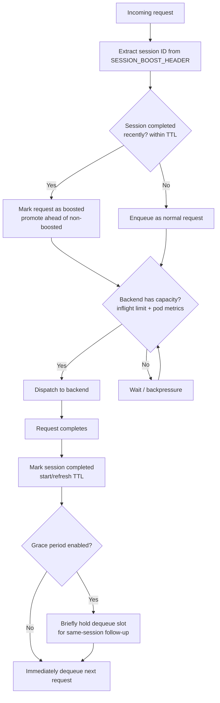

# Session Boost Queue

Kthena Router session boost queue optimizes multi-turn conversation performance by prioritizing follow-up requests from the same conversation session. This maximizes **prefix cache hit rate** on LLM inference backends (e.g., vLLM), significantly reducing Time-to-First-Token (TTFT) for multi-turn conversations.

This guide explains what session boost does, when to use it, how to enable it, and how to verify it is working.

## Overview

Modern LLM inference engines like vLLM maintain a **prefix cache** (KV cache) that stores previously computed key-value attention states. In multi-turn conversations, each follow-up message shares a large prefix with the previous turn. If the follow-up request is processed shortly after the prior turn completes, the prefix cache is still warm, and the engine can skip recomputing attention for the shared prefix—reducing TTFT by 50–80%.

Without session boost, a follow-up request may be queued behind unrelated requests. By the time it reaches the backend, the prefix cache may have been evicted, forcing a full recomputation.

When session boost is enabled, the router does the following:

1. Extracts the session identifier from the HTTP header configured via `SESSION_BOOST_HEADER` environment variable.
2. Checks whether the same session completed a request recently (within TTL).
3. If yes, marks the new request as **boosted** and promotes it ahead of non-boosted requests in the queue.
4. After a request completes, optionally enters a brief **grace period** (disabled by default) to give a potential follow-up from the same session time to arrive.

The following diagram summarizes this flow:



## When to Use Session Boost

Session boost is designed for these scenarios:

- **Multi-turn chat applications**: ChatGPT-like interfaces where users have back-and-forth conversations with an LLM. Each turn builds on the previous conversation context.
- **Agentic workflows and RAG chains**: Automated pipelines that issue multiple sequential requests in the same session, where each request depends on the previous response.
- **Low-latency prefix cache optimization**: Workloads where minimizing TTFT is critical and the same session's requests benefit from being processed back-to-back on warm KV cache.
- **Prefix cache optimization instead of per-user fairness**: When you want the shared fairness queue to prioritize warm KV cache reuse rather than equitable per-user resource sharing.

Session boost is **not** needed when:

- Your workload is single-turn (independent requests with no shared prefix).
- You need multi-tenant fairness as the primary scheduling concern (use [fairness scheduling](./fairness-scheduling) instead). Session sticky routing is complementary and can be combined with session boost (see [Operational Notes](#operational-notes)).

## Prerequisites

- A Kubernetes cluster with Kthena installed.
- **Fairness scheduling enabled** (`ENABLE_FAIRNESS_SCHEDULING=true`). Session boost is a mode of the fairness queue, so it only takes effect when fairness scheduling is enabled. If `ENABLE_SESSION_BOOST=true` is set without fairness scheduling, the router logs a warning and ignores session boost.
- A deployed `ModelRoute` and backend `ModelServer` (e.g., vLLM) that supports prefix caching.
- Clients that include a consistent session identifier header across related requests in a conversation.

## Enable Session Boost

### Helm Values

The simplest way to enable session boost is through Helm values:

```yaml
networking:
  kthenaRouter:
    fairness:
      enabled: true            # Required: session boost is a mode of the fairness queue
    sessionBoost:
      enabled: true
      header: "X-Session-ID"
      ttl: "60s"
```

Apply with Helm:

```bash
helm upgrade --install kthena charts/kthena \
  --namespace kthena-system \
  --create-namespace \
  -f your-values.yaml
```

### Environment Variables

You can also configure session boost directly via environment variables on the `kthena-router` Deployment:

```yaml
env:
- name: ENABLE_FAIRNESS_SCHEDULING
  value: "true"              # Required: session boost runs as a mode of the fairness queue
- name: ENABLE_SESSION_BOOST
  value: "true"
- name: SESSION_BOOST_HEADER
  value: "X-Session-ID"
- name: SESSION_BOOST_TTL
  value: "60s"
# - name: SESSION_BOOST_GRACE_PERIOD
#   value: "50ms"              # Disabled by default; enable only if you understand the trade-off
- name: SESSION_BOOST_POLL_INTERVAL
  value: "100ms"
# - name: FAIRNESS_MAX_CONCURRENT
#   value: "32"               # Global total inflight limit in session-boost mode.
#                             # Size it yourself: estimated per-pod concurrency x pod count.
```

## Configuration Reference

| Environment Variable          | Purpose                                                                           | Default      | Notes                                                                                                                                                                                                                                       |
| ----------------------------- | --------------------------------------------------------------------------------- | ------------ | ------------------------------------------------------------------------------------------------------------------------------------------------------------------------------------------------------------------------------------------- |
| `ENABLE_FAIRNESS_SCHEDULING`  | Enable the fairness queue (required for session boost)                            | `false`      | Session boost is a mode of this queue; it is ignored unless this is `true`                                                                                                                                                                  |
| `ENABLE_SESSION_BOOST`        | Enable session-boost mode on the fairness queue                                   | `false`      | Requires `ENABLE_FAIRNESS_SCHEDULING=true`                                                                                                                                                                                                  |
| `SESSION_BOOST_HEADER`        | HTTP header used to identify conversation sessions                                | *(required)* | Must match what your clients send                                                                                                                                                                                                           |
| `SESSION_BOOST_TTL`           | Duration after which a session's boost expires                                    | `60s`        | Longer values help slow human conversations; shorter values suit fast automated pipelines                                                                                                                                                   |
| `SESSION_BOOST_GRACE_PERIOD`  | Wait time after a request completes for a same-session follow-up to arrive        | `0`          | Disabled by default. Only enable (e.g., `50ms`) if you understand the latency trade-off for non-boosted requests                                                                                                                            |
| `SESSION_BOOST_POLL_INTERVAL` | Interval at which the queue polls backend pod metrics to check available capacity | `100ms`      | Lower values react faster to capacity changes but increase metrics polling load                                                                                                                                                             |
| `FAIRNESS_MAX_CONCURRENT`     | Total inflight requests admitted to backends (session-boost mode)                 | `16`         | Reused from fairness scheduling. It is a **global** limit, not per-pod. In session-boost mode you must size it yourself based on the estimated per-pod concurrency (e.g., vLLM's `--max-num-seqs`) multiplied by the number of backend pods |

## Client Integration

Clients must include the configured session header in their requests. All requests belonging to the same conversation should use the same header value:

```bash
# Turn 1
curl -X POST http://kthena-router/v1/chat/completions \
  -H "Content-Type: application/json" \
  -H "X-Session-ID: conv-abc-123" \
  -d '{"model": "llama-3", "messages": [{"role": "user", "content": "Hello"}]}'

# Turn 2 (same session)
curl -X POST http://kthena-router/v1/chat/completions \
  -H "Content-Type: application/json" \
  -H "X-Session-ID: conv-abc-123" \
  -d '{"model": "llama-3", "messages": [{"role": "user", "content": "Hello"}, {"role": "assistant", "content": "Hi!"}, {"role": "user", "content": "Tell me about Kubernetes"}]}'
```

### Custom Header

If your clients already use a different header for session tracking, configure the router to match:

```yaml
env:
- name: SESSION_BOOST_HEADER
  value: "X-Session-ID"
```

Then clients send:

```bash
curl -X POST http://kthena-router/v1/chat/completions \
  -H "X-Session-ID: my-conversation-42" \
  -d '{"model": "llama-3", "messages": [...]}'
```

## How It Works

### Priority Ordering

The session boost queue uses a simple two-level priority:

1. **Boosted requests** (session completed recently) are always dequeued before non-boosted requests.
2. **Within the same boost level**, requests are served in FIFO order (earliest arrival first).

### Grace Period

The grace period is **disabled by default** (`SESSION_BOOST_GRACE_PERIOD=0`). When disabled, the queue immediately dequeues the next request after a completion without waiting.

When explicitly enabled (e.g., `SESSION_BOOST_GRACE_PERIOD=50ms`), the queue briefly holds the dequeue slot for a potential follow-up from the same session:

- If a boosted request arrives during the grace period, it is dequeued immediately.
- If no boosted request arrives before the grace period expires, the next non-boosted request proceeds normally.
- If the head of the queue is already a boosted request, the grace period is skipped entirely.

Only enable the grace period if you understand the trade-off: it adds latency to non-boosted requests in exchange for a higher chance of a same-session follow-up arriving in time. This is mainly useful for fast automated pipelines (RAG, agents) where follow-up requests arrive within milliseconds of the previous response.

### Backpressure Control

The queue uses two-level admission control to avoid flooding backends:

1. **Inflight limit**: at most `FAIRNESS_MAX_CONCURRENT` requests can be in-flight across all backends simultaneously. This is a global limit; size it from your estimated per-pod concurrency and the number of backend pods.
2. **Backend metrics check**: the queue polls backend pod metrics to confirm at least one pod has available capacity before dispatching.

When a request completes, the queue immediately attempts to dequeue the next request (release-driven dequeue) rather than waiting for the next polling tick.

## Session Boost vs Fairness Scheduling

Session boost and fairness scheduling share the same underlying per-model request priority queue but configure it for different goals. Enabling session boost switches that queue from per-user fairness ordering to session-aware boosting:

| Aspect           | Session Boost                      | Fairness Scheduling               |
| ---------------- | ---------------------------------- | --------------------------------- |
| Goal             | Maximize prefix cache hits         | Equitable resource allocation     |
| Activation       | `ENABLE_SESSION_BOOST=true`        | `ENABLE_FAIRNESS_SCHEDULING=true` |
| Requires user ID | No                                 | Yes                               |
| Priority logic   | Boosted > non-boosted, FIFO within | Lower recent usage wins           |
| Best for         | Multi-turn latency optimization    | Multi-tenant contention           |

Because both modes are driven by the same queue, they are **mutually exclusive**—when session boost is enabled, per-user fairness ordering is turned off for that queue. Enable one or the other based on your primary scheduling concern.

## Choosing Good Settings

Start with the defaults unless you have a specific performance issue.

Recommended tuning:

- **Human chat applications** (slow follow-ups): increase `SESSION_BOOST_TTL` to `120s` or higher so the boost persists between human typing intervals.
- **Automated pipelines** (fast follow-ups): keep `SESSION_BOOST_TTL` at `60s`. Consider enabling `SESSION_BOOST_GRACE_PERIOD` (e.g., `50ms`) if your pipeline issues follow-up requests within milliseconds and you want to maximize prefix cache hits.
- **High-throughput backends**: the default total inflight limit (`FAIRNESS_MAX_CONCURRENT=16`) is conservative. Size it yourself as roughly the per-pod concurrency (e.g., vLLM's `--max-num-seqs`) times the number of backend pods. Reduce for conservative admission control; increase for backends that handle high parallelism.
- **Latency-sensitive workloads**: reduce `SESSION_BOOST_POLL_INTERVAL` to `50ms` for faster reaction to backend capacity changes.

## Verify Session Boost

### 1. Check Router Environment

```bash
kubectl -n kthena-system get deployment kthena-router -o yaml | grep SESSION_BOOST
```

Confirm the router is running with expected session boost variables.

### 2. Inspect Logs

When a session boost is triggered, the router logs the event. Look for session boost enqueue and dequeue messages:

```bash
kubectl -n kthena-system logs deploy/kthena-router | grep -i "session boost"
```

### 3. Compare TTFT With and Without Boost

Send a multi-turn conversation and measure TTFT for the second turn:

- **Without session boost**: TTFT for Turn 2 ≈ TTFT for Turn 1 (full prefix computation).
- **With session boost**: TTFT for Turn 2 should be significantly lower (prefix cache hit).

## Operational Notes

- Session state is **in memory** on each router instance. In multi-replica deployments, state is not shared across replicas. Combine with session sticky routing to ensure the same session hits the same router instance.
- Session boost does not guarantee pod affinity. For maximum prefix cache benefit, combine with session sticky routing so boosted requests reach the pod that holds the warm KV cache.
- Requests without the configured session header are enqueued as normal (non-boosted) requests.
- Session tracking does not survive router restarts.

## Troubleshooting

### Requests are not being boosted

Verify that:
1. Both `ENABLE_FAIRNESS_SCHEDULING` and `ENABLE_SESSION_BOOST` are set to `true` in the router environment. Session boost is ignored (with a warning) if fairness scheduling is disabled.
2. The client sends the configured header (set via `SESSION_BOOST_HEADER`) with a consistent value across turns.
3. The follow-up request arrives within `SESSION_BOOST_TTL` of the previous request's completion.

### TTFT is not improving despite boost

Session boost only controls queue ordering. If the boosted request is routed to a different pod than the one holding the warm prefix cache, no TTFT improvement occurs. Combine session boost with session sticky routing for full benefit.

### Grace period causes slight latency for non-boosted requests

The grace period is disabled by default. If you have explicitly enabled it and it adds unwanted delay for single-turn traffic, set `SESSION_BOOST_GRACE_PERIOD=0` to disable it.

### High memory usage from session tracking

Each tracked session consumes minimal memory (session ID + timestamp). Sessions are automatically evicted after TTL. If you have millions of concurrent sessions, consider reducing `SESSION_BOOST_TTL`.

## Related Guides

- [Fairness Scheduling](./fairness-scheduling)
- [Router Routing](./router-routing)
- [Router Observability](./router-observability)
